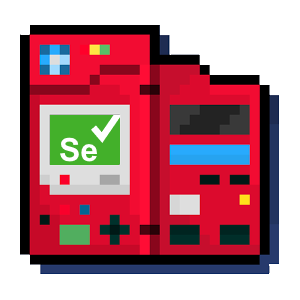

[![MIT License][license-shield]][license-url]
[![LinkedIn][linkedin-shield]][linkedin-url]


<!-- PROJECT LOGO -->
<br />
<p align="center">
  <a href="https://github.com/jsperandio/pokedex-selenium">
    
  </a>

  <h3 align="center">pokedex-selenium</h3>

  <p align="center">
    This project is a simple use of selenium with python to extract all pokemons from pokedex, 
    just for study/learning proposes.
    <br />
    <br />
    The Pokedex site used (only Kanto Region) : 
    <a href="https://pokemondb.net/pokedex/stats/gen1"><strong>PokemonDb</strong></a>
    <br />
  </p>


<!-- TABLE OF CONTENTS -->
## Table of Contents

* [About the Project](#about-the-project)
  * [Built With](#built-with)
* [Getting Started](#getting-started)
  * [Prerequisites](#prerequisites)
  * [Installation](#installation)
* [Usage](#usage)
* [Contributing](#contributing)
* [License](#license)
* [Contact](#contact)
* [Acknowledgements](#acknowledgements)


<!-- ABOUT THE PROJECT -->
## About The Project

With the constant increase in the amount of data generated by users on the internet, the number of data sources has been increasing and
increasingly diversifying, the process of obtaining data from unusual sources such as articles and even competitor websites has been growing
and with it the need to carry out periodic processes to extract this information, selenium as well as other projects exist to streamline
and automate those processes.
This project comes as learning to perform this extraction in a simple and practical way.

Here's why:
* As a developer we have to be constantly learning and optimizing our knowledge
* When you are learning things , see examples is one of the best ways to start

You may also suggest changes by forking this repo and creating a pull request or opening an issue.

A list of commonly used resources that I find helpful are listed in the acknowledgements.

### Built With

* [Python](https://www.python.org/)
* [Selenium](https://www.selenium.dev/)

<!-- GETTING STARTED -->
## Getting Started

### Prerequisites

* Python language bindings for Selenium WebDriver.
```sh
pip install selenium
```

### Installation

1. Clone the repo.
```sh
git clone https://github.com/jsperandio/pokedex-selenium.git
```

<!-- CONTRIBUTING -->
## Contributing

Contributions are what make the open source community such an amazing place to be learn, inspire, and create. Any contributions you make are **greatly appreciated**.

1. Fork the Project
2. Create your Feature Branch (`git checkout -b feature/AmazingFeature`)
3. Commit your Changes (`git commit -m 'Add some AmazingFeature'`)
4. Push to the Branch (`git push origin feature/AmazingFeature`)
5. Open a Pull Request


<!-- LICENSE -->
## License

Distributed under the MIT License. See `LICENSE` for more information.


<!-- CONTACT -->
## Contact

João Vitor Esperandio Barbosa - jsperandiob@gmail.com

Project Link: [https://github.com/jsperandio/pokedex-selenium](https://github.com/your_username/repo_name)


<!-- ACKNOWLEDGEMENTS -->
## Acknowledgements
* [Selenium Unofficial Docs](https://selenium-python.readthedocs.io/)
* [Selenium Docs](https://www.selenium.dev/documentation/en/)
* [XPath](https://www.w3schools.com/xml/xpath_intro.asp)
* [Css Selector](https://www.w3schools.com/cssref/css_selectors.asp)
* [Pokemon Database](https://pokemondb.net/)
* [Img Shields](https://shields.io)
* [Choose an Open Source License](https://choosealicense.com)
* [GitHub Pages](https://pages.github.com)


<!-- MARKDOWN LINKS & IMAGES -->
[license-shield]: https://img.shields.io/github/license/othneildrew/Best-README-Template.svg?style=flat-square
[license-url]: https://github.com/jsperandio/pokedex-selenium/blob/master/LICENSE
[linkedin-shield]: https://img.shields.io/badge/-LinkedIn-black.svg?style=flat-square&logo=linkedin&colorB=555
[linkedin-url]: https://www.linkedin.com/in/jsperandiob/
